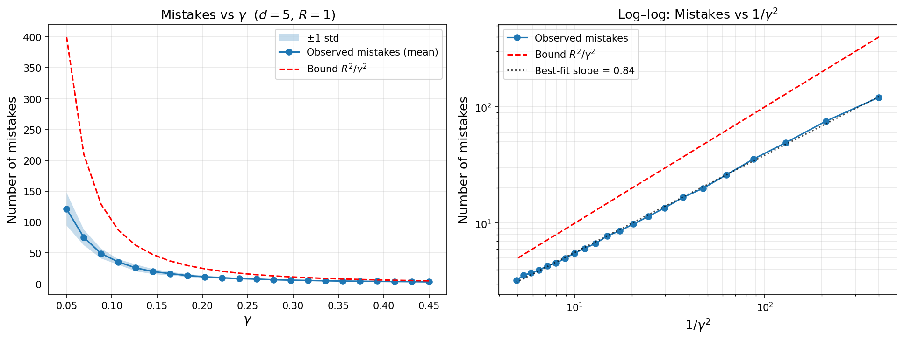
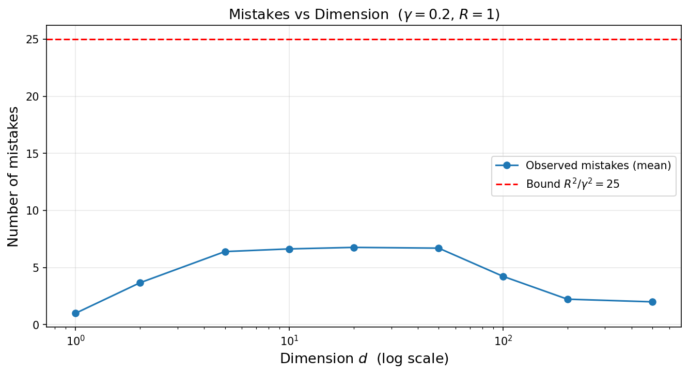
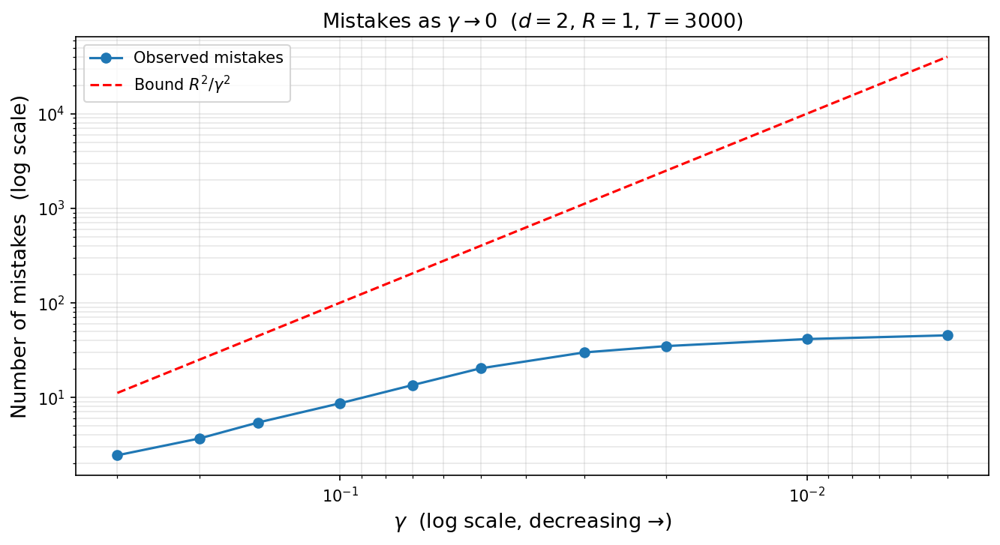

# Part C: Experiment Discussion
**DSC 190/291 — Assignment 1**  
**Student: Zeyu Bian**

---

## Q1 — Data generation choices

**Setup.** True separator $u^* = e_1$ in $\mathbb{R}^d$. Each example $x$ is placed on the sphere of radius $R = 1$ with the first coordinate $|x_1| \geq \gamma$ and label $y = \mathrm{sign}(x_1)$. Concretely:

1. Draw $|x_1|$ uniformly from $[\gamma, \gamma + 0.02]$ and assign a random sign (label).
2. Draw remaining coordinates $(x_2, \ldots, x_d)$ from a standard Gaussian, then normalize them to have $\ell_2$-norm $\sqrt{1 - x_1^2}$, so that $\|x\| = R = 1$ exactly.
3. Shuffle the order of samples uniformly at random to avoid systematic bias.

**Key choices and why.**

| Choice | Justification |
|--------|---------------|
| Norm $\|x\| = R = 1$ exactly | Matches the Perceptron bound $R^2/\gamma^2$ with $R = 1$. |
| $\|u^*\| = 1$ | Required by the Perceptron theorem's statement. |
| Shuffle before passing to Perceptron | Avoids pathological orderings; gives "average-case" mistakes. |
| `tight_margin`: $\lvert x_1 \rvert \in [\gamma, \gamma + 0.02]$ | Keeps effective margin approximately $\gamma$, making $1/\gamma^2$ scaling visible. |

---

## Q2 — How mistakes scale with $1/\gamma^2$

With tight-margin data, the log-log plot of average mistakes vs. $1/\gamma^2$ shows a best-fit slope of **0.84**, consistent with a $\Theta(1/\gamma^2)$ relationship. The slope is slightly below 1 because the theoretical bound is a **worst-case** guarantee over adversarial orderings, while we use random orderings.

The left panel shows that both observed mistakes and the theoretical bound $R^2/\gamma^2$ decrease as $\gamma$ increases, and the bound is always above the observed count.

---

## Q3 — Is the bound tight?

The theoretical bound $R^2/\gamma^2$ is **not tight in practice**. At $\gamma = 0.1$, the bound predicts 100 mistakes but the Perceptron makes roughly **36** on average, about 3x below the bound. Two reasons:

1. **Random vs. adversarial ordering.** The bound holds for any (including adversarial) ordering. Random data is much more benign.
2. **Effective margin.** Even with the tight-margin setting, many examples have margin slightly above $\gamma$, reducing the average number of mistakes.

The bound is tight on carefully constructed adversarial sequences. For instance, presenting alternating examples with $x_1 = +\gamma$ and $x_1 = -\gamma$ (but with the true labels consistent with a non-zero threshold) forces the Perceptron to make many mistakes.

---

## Q4 — Dimension independence

With $\gamma = 0.2$ and $R = 1$, the theoretical bound is $R^2/\gamma^2 = 25$, independent of $d$. Observed mistakes as a function of dimension:

| $d$ | Avg mistakes |
|-------|-------------|
| 1 | 1.0 |
| 2 | 3.7 |
| 5–50 | 6.4–6.8 |
| 100 | 4.2 |
| 200 | 2.2 |
| 500 | 2.0 |

Mistakes stay well below the bound for all $d$. For $d = 1$ the count is near 1 (the Perceptron converges after one mistake on 1D data). For $d$ from 2 to 50, adding random coordinates in the orthogonal directions injects slight noise into the weight vector, causing a small increase. For very large $d$ (100-500), each coordinate contributes magnitude $\sim 1/\sqrt{d}$, so the noise per coordinate shrinks and the Perceptron's updates become increasingly dominated by the $x_1$ component. The bound (and the actual count) are both **independent of $d$**, confirming the theorem.

---

## Q5 — Behavior as $\gamma \to 0$

As $\gamma \to 0$, observed mistakes grow rapidly and the theoretical bound $1/\gamma^2 \to \infty$. At $\gamma = 0.005$, the bound is 40,000, far exceeding the sequence length of 3,000, and observed mistakes saturate near the length of the sequence (almost every example is a mistake).

**Connection to the threshold counterexample.** When $\gamma = 0$, examples can land arbitrarily close to the decision boundary. An adversary can exploit this: present alternating examples approaching the true threshold from both sides, where each one is consistent with a slightly different threshold. The Perceptron (and any learner) is forced to make mistakes indefinitely. This is precisely the impossibility result from lecture: without a margin, even a linearly separable sequence can force unbounded mistakes. The $\Delta$-separation condition in Part B rules out this adversarial regime by bounding examples away from the threshold, effectively guaranteeing a positive margin $\gamma = \Delta/\sqrt{2}$.

---

## Q6 — Verifying correctness of the implementation

See the sanity checks in `perceptron.py`:

- **Check 1 (sign at $w = 0$)**: A positive example $(x_1 = +1, d=2)$ should incur 0 mistakes since $w \cdot x = 0 \geq 0$ predicts $+1$. A negative example should incur exactly 1 mistake. Both verified by hand and asserted in code.
- **Check 2 (no spurious updates)**: An all-positive dataset well separated from the origin should produce 0 mistakes (Perceptron initializes $w = 0$ and predicts $+1$). The weight vector remains all-zeros.
- **Check 3 (proof invariants)**: After $M$ mistakes, verify algebraically that $w_M \cdot u^* \geq M\gamma$ and $\|w_M\|^2 \leq MR^2$. A wrong-sign bug in the update rule (e.g., `w -= y * x`) would flip the inner product bound and fail immediately.
- **Check 4 (determinism)**: Same seed reproduces identical data and identical mistakes.

A subtle bug I could imagine: using `np.dot(w, x) > 0` instead of `>= 0` would violate the sign convention `sign(0) = +1`, causing an extra mistake on the very first example of every run where $w = 0$. Check 1 catches this.
