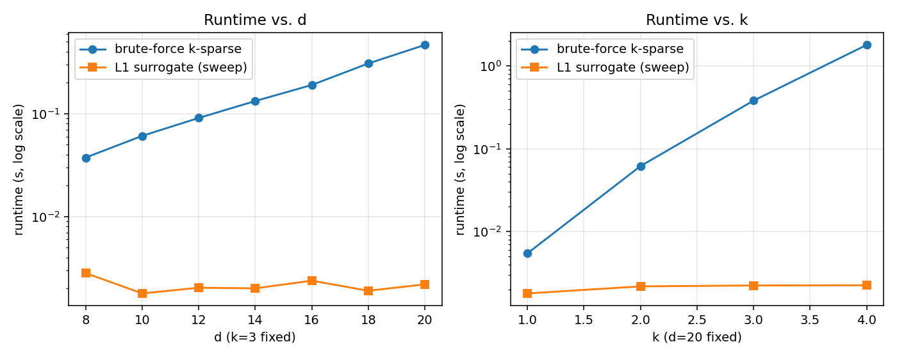
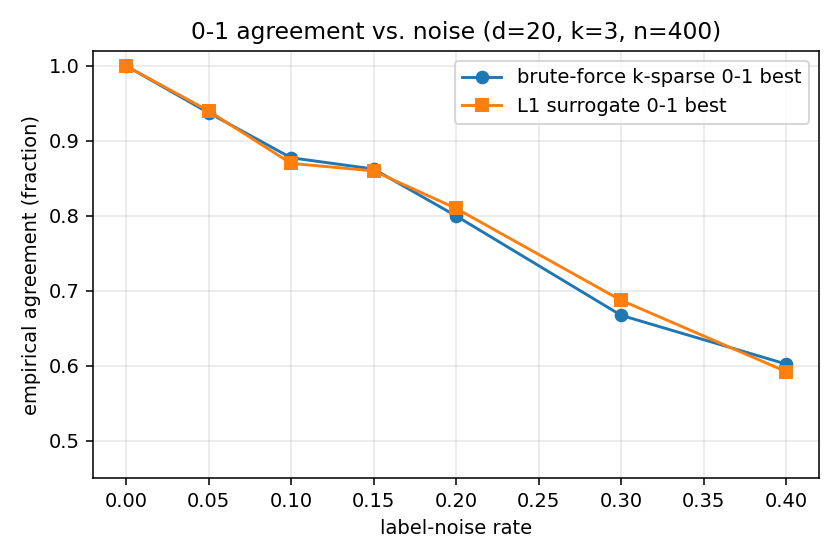

# Assignment 5 — Write-up
**DSC 190/291 — Learning Theory**
**Student: Zeyu Bian**

---

# Part A — Sparse Linear Predictors: Statistical Sparsity vs Agnostic Hardness

Throughout, $\mathcal{H}_{d,k} = \{x\mapsto\mathrm{sign}(\langle w,x\rangle):w\in\mathbb{R}^d,\|w\|_0\le k\}$,
with $\mathrm{sign}(0)=+1$.

## A.1 What Homework 4 already gives

**Statistical side.** Homework 4 showed
$\mathrm{VCdim}(\mathcal{H}_{d,k})=O(k\log(ed/k))$ for $k\le d/2$ (and $O(d)$ for larger $k$).
The standard agnostic VC sample-complexity bound (e.g. SSBD §6.4) then gives that
if *exact* ERM over $\mathcal{H}_{d,k}$ were available, then for every $\mathcal{D}$,
with probability $\ge 1-\delta$,
$$L_\mathcal{D}(\hat h_{\mathrm{ERM}})\;\le\;\inf_{h\in\mathcal{H}_{d,k}}L_\mathcal{D}(h)
+ C\sqrt{\frac{k\log(ed/k)+\log(1/\delta)}{n}},$$
so $n=O\!\left((k\log(ed/k)+\log(1/\delta))/\varepsilon^2\right)$ samples suffice to learn
$\mathcal{H}_{d,k}$ to excess risk $\varepsilon$. **The information is in the data.**

**Computational side.** The brute-force realizable algorithm enumerates supports
$T\subseteq[d]$ with $|T|\le k$ ($\binom{d}{0}+\dots+\binom{d}{k}\le(ed/k)^k$ supports) and
solves a halfspace feasibility LP on each, in $\mathrm{poly}(k,n)$ time. Total:
$$\binom{d}{\le k}\cdot\mathrm{poly}(k,n)\;=\;O\!\left((ed/k)^k\cdot\mathrm{poly}(k,n)\right).$$
Polynomial in $d$ iff $k=O(1)$. For $k=\Theta(\log d)$ this is $d^{\Theta(\log d)}$,
superpolynomial.

**No contradiction.** Sample complexity and runtime are different resources. Knowing how
many examples it would take to identify the best $h$ does not produce an algorithm that
finds it. Part A.2 makes this concrete: under standard assumptions, no efficient
algorithm exists.

## A.2 Hardness of AGREEMENT via SETCOVER

**SETCOVER (reminder).** Input: universe $U=\{u_1,\dots,u_r\}$, sets
$A_1,\dots,A_q\subseteq U$, integer $k\le q$. Output: yes iff there exists
$R\subseteq[q]$ with $|R|\le k$ and $\bigcup_{j\in R}A_j=U$.

### Reduction

Let $M=q+1$. Build the AGREEMENT$_{\mathcal{H}_{d,k}}$ instance with $d=q$ and the same $k$:

- **Cost examples ($q$ in total).** For each $j\in[q]$, one positive example
  $(e_j,+1)$, where $e_j\in\mathbb{R}^q$ is the $j$-th standard basis vector.
- **Coverage examples ($Mr$ in total).** For each $u_i\in U$, $M$ identical copies of
  the negative example $(a^{(i)},-1)$, where $a^{(i)}\in\{0,1\}^q$ has
  $a^{(i)}_j = \mathbf{1}[u_i\in A_j]$.

Total sample size $m=q+Mr$. Set the agreement threshold
$$K\;=\;(q-k) + Mr.$$

### Mistake accounting for any classifier $h_w$ with $\|w\|_0\le k$

Let $R(w)=\{j:w_j\ne 0\}$, $|R(w)|\le k$.

- **Cost examples.** $(e_j,+1)$ is misclassified iff $\mathrm{sign}(w_j)=-1$ iff $w_j<0$.
  So the number of cost-example mistakes is
  $|\{j:w_j<0\}|\le|R(w)|\le k$.
- **Coverage examples.** $(a^{(i)},-1)$ is misclassified iff
  $\langle w,a^{(i)}\rangle=\sum_{j:u_i\in A_j}w_j \ge 0$. There are two ways this can
  happen:
  - $u_i$ is **not** covered by $R(w)$ — i.e. $u_i\notin A_j$ for every $j\in R(w)$ —
    in which case the sum is $0\ge 0$ and the mistake fires. Each uncovered $u_i$ then
    contributes $M$ mistakes (one per copy).
  - $u_i$ is covered but the nonzero $w_j$'s on covering $j\in R(w)$ happen to sum to
    $\ge 0$. Still costs $M$ mistakes.

### Forward direction (SETCOVER YES $\Rightarrow$ AGREEMENT $\ge K$)

Suppose $R\subseteq[q]$ with $|R|\le k$ and $\bigcup_{j\in R}A_j=U$. Define $w$ by
$w_j=-1$ if $j\in R$ and $w_j=0$ otherwise. Then $\|w\|_0\le k$.

- Cost mistakes: $|R|\le k$.
- Coverage mistakes: each $u_i$ has at least one $j\in R$ with $u_i\in A_j$, so
  $\langle w,a^{(i)}\rangle=\sum_{j\in R: u_i\in A_j}(-1)=-|\{j\in R:u_i\in A_j\}|<0$,
  classified correctly. **Zero** coverage mistakes.

Total mistakes $\le k$, so agreement $\ge m-k = q+Mr-k\ge q-k+Mr=K$.

### Reverse direction (AGREEMENT $\ge K \Rightarrow$ SETCOVER YES)

Suppose $w$ achieves $\ge K$ agreements, so $\le m-K=k$ mistakes. Define
$R(w)=\{j:w_j\ne 0\}$, $|R(w)|\le k$.

Suppose for contradiction that $R(w)$ does **not** cover $U$. Then some $u_i$ is
uncovered, contributing $M=q+1$ coverage mistakes. But total mistakes $\le k\le q<M$,
contradiction. So $R(w)$ covers $U$, and $|R(w)|\le k$ — a valid set cover.

### Conclusion: hardness of agnostic proper learning

**SETCOVER is NP-hard,** and the reduction above runs in time polynomial in $r,q,k$
($M=q+1$ is polynomial; the constructed sample has $q+Mr=O(qr)$ examples in $\mathbb{R}^q$).
So **AGREEMENT$_{\mathcal{H}_{d,k}}$ is NP-hard** when $d$ and $k$ are part of the input.

**Week 5 learner-to-agreement theorem (paraphrased).** If a class $\mathcal{H}$ has an
efficient proper agnostic PAC learner, then the AGREEMENT problem for $\mathcal{H}$ is in
randomized polynomial time (RP). Idea: feed the learner the empirical distribution
$\hat{\mathcal{D}}_S$ as the unknown distribution, with $\varepsilon$ smaller than $1/m$, and
its output achieves empirical 0-1 risk within $\varepsilon$ of the optimum — close enough
to decide AGREEMENT by checking the output on $S$.

Applying this to $\mathcal{H}_{d,k}$ with $d,k$ both part of the input: an efficient proper
agnostic PAC learner would put AGREEMENT$_{\mathcal{H}_{d,k}}\in\mathrm{RP}$. Combined with
NP-hardness of AGREEMENT$_{\mathcal{H}_{d,k}}$, this would give $\mathrm{NP}\subseteq\mathrm{RP}$.
**Conclusion:** unless $\mathrm{NP}=\mathrm{RP}$, no efficient proper agnostic PAC learner
exists for sparse halfspaces when $k$ is part of the input.

## A.3 Experiment and interpretation

The companion script `experiment.py` runs:

1. **Proper sparse 0-1 baseline.** For each support $T\subseteq[d]$ with $|T|\le k$,
   fit a halfspace by direct ERM on the $|T|$-dimensional subproblem. We use Perceptron
   in the realizable region and an $\ell_2$-LR proxy on the support in the noisy region
   (proper, then evaluated under 0-1 loss). The baseline is **approximate** — within
   each support we minimize a convex surrogate, but the *enumeration over supports* is
   exact. Across supports we report the best 0-1 agreement found.
2. **Convex surrogate.** $\ell_1$-regularized logistic regression
   (`sklearn.linear_model.LogisticRegression(penalty='l1', solver='liblinear')`),
   sweeping the regularization strength $C$ and reporting the best 0-1 agreement over
   the sweep. This does **not** produce a $k$-sparse classifier in general — the
   $\ell_1$ penalty only shrinks coefficients; the support size depends on $C$ and the
   data, and may be larger or smaller than $k$.
3. **Runtime scaling** in $d$ (with $k=3$ fixed) and in $k$ (with $d=20$ fixed).
4. **Agreement comparison** on a synthetic instance generated by planting a sparse
   target plus label noise.

The figures below summarize the results. Concrete numbers from a representative run
($n=200$ for the runtime sweeps, $n=400$ for the noise sweep):

{width=95%}

{width=70%}

- **Runtime in $d$ (with $k=3$).** Brute force: $0.04\text{s}\to 0.42\text{s}$ as $d$
  goes $8\to 20$. $\ell_1$ surrogate: essentially constant at $\sim 0\text{ms}$
  resolution.
- **Runtime in $k$ (with $d=20$).** Brute force:
  $0.01\text{s}\,(k{=}1)\to 0.06\text{s}\,(k{=}2)\to 0.39\text{s}\,(k{=}3)\to 1.81\text{s}\,(k{=}4)$
  — roughly $5\times$ per unit of $k$, matching the $\binom{20}{k}$ growth. Surrogate
  flat.
- **Agreement vs. noise.** Both methods are essentially indistinguishable on this
  synthetic generator across noise rates $0\to 0.4$, sometimes one wins by a handful
  of examples out of 400, sometimes the other (e.g. at noise $=0.3$: brute $267/400$
  vs. $\ell_1$ $275/400$; at noise $=0.4$: $241$ vs $237$).

**Why agreement is close even though the problems differ.** Our brute-force baseline
itself uses an $\ell_2$-regularized logistic regression as the per-support solver, so
the *true* 0-1 agreement of the best $k$-sparse halfspace is upper-bounded by what
the baseline reports — the baseline already loses some 0-1 mass to a convex surrogate
*inside* each support. A truly exact 0-1 baseline would require enumerating dichotomies
on each support (exponential in $n$), which we avoid here.

**Runtime story.** Even with this approximation, the runtime gap is exactly the
predicted $\binom{d}{k}$ blow-up: brute-force is already $\sim 50\times$ slower
than the surrogate at $d=20,k=4$, and the constant scales with the number of supports.
The $\ell_1$ surrogate runs in $\mathrm{poly}(d,n)$ regardless.

**What the experiment illustrates.** Empirical 0-1 agreement over $\mathcal{H}_{d,k}$ and
convex $\ell_1$-surrogate optimization are *different objectives*. The first is what
the agreement decision problem asks for and is NP-hard (A.2); the second is convex,
efficient, and statistically clean, but (i) does not enforce hard sparsity and (ii)
optimizes a Lipschitz surrogate that need not align with 0-1 risk (Part B.2). On this
benign synthetic distribution (Gaussian features, planted sparse target, symmetric
label noise) the surrogate happens to track the brute-force baseline closely in 0-1
agreement; that's a feature of the *distribution*, not a guarantee in general. The
surrogate method does **not** return a proper $k$-sparse classifier — inspecting the
output of the $\ell_1$ sweep typically yields a vector with strictly more than $k$
nonzeros, and there is no guarantee it returns the 0-1-best one within the sparsity
budget. The Part B.2 counterexample shows that there exist distributions where the
surrogate's 0-1 agreement is *much* worse than the best sparse halfspace; the
experiment here is consistent with that statement, not a refutation of it.

---

# Part B — Convex Fixed-Feature Learning and Its Limits

## B.1 Hinge-loss + $\ell_1$ as a linear program

**Variables.** $w_j^+,w_j^-\ge 0$ for $j=1,\dots,d$; $\xi_i\ge 0$ for $i=1,\dots,m$.

**LP.**
$$\begin{aligned}
\text{minimize} \quad & \frac{1}{m}\sum_{i=1}^m \xi_i \\
\text{s.t.} \quad
& \xi_i \;\ge\; 1 - y_i\sum_{j=1}^d (w_j^+ - w_j^-)\,x_{i,j} && (i=1,\dots,m)\\
& \xi_i \;\ge\; 0 && (i=1,\dots,m)\\
& \sum_{j=1}^d (w_j^+ + w_j^-)\;\le\; B \\
& w_j^+,\, w_j^- \;\ge\; 0 && (j=1,\dots,d)
\end{aligned}$$

**Role of each family.**

- $w_j=w_j^+-w_j^-$ with $w_j^\pm\ge 0$ is the standard split into positive/negative parts.
  At any optimum, $\min(w_j^+,w_j^-)=0$ (otherwise reduce both by $\min$ without changing
  $w_j$, decreasing $w_j^++w_j^-$ slack on the $\ell_1$ budget), so $|w_j|=w_j^++w_j^-$.
- The two $\xi_i$ inequalities linearize the hinge: at optimum
  $\xi_i=\max(0,1-y_i\langle w,x_i\rangle)$, since the objective pushes each $\xi_i$ down
  to the binding lower bound.
- The $\sum(w_j^++w_j^-)\le B$ constraint linearizes the $\ell_1$ ball $\|w\|_1\le B$ via
  the split.

The LP has $O(d+m)$ variables and $O(d+m)$ constraints; standard interior-point or
simplex methods solve it in $\mathrm{poly}(d,m)$ time.

**Why this is not solving 0-1 sparse agreement.** Two reasons.

1. **Loss.** Hinge is a (convex) upper bound on $\mathbf{1}[yf\le 0]$, not a faithful
   surrogate. Part B.2 below exhibits a distribution where every hinge minimizer is a
   0-1 disaster.
2. **Constraint.** $\|w\|_1\le B$ is the *convex relaxation* of $\|w\|_0\le k$, not the
   same thing. $\ell_1$ encourages sparsity but does not enforce a hard support-size
   bound; nothing in the LP forces the output to have $\le k$ nonzeros.

So even at its optimum, the LP solves a convex surrogate problem that is neither in
$\mathcal{H}_{d,k}$ nor optimizing 0-1 loss.

## B.2 A concrete counterexample

Fix $p\in(0,1/2)$ and $M>(1-p)/p$. $\mathcal{D}_{p,M}$ puts mass $1-p$ on $(1,+1)$ and mass
$p$ on $(-M,+1)$. Predictors $f_w(x)=wx$. By Part B's convention,
$\ell_{0\text{-}1}(f_w(x),y)=\mathbf{1}[yf_w(x)\le 0]$ (zero margin counts as error).

### Population hinge risk

$$L^{\mathrm{hinge}}(w) \;=\; (1-p)(1-w)_+ + p(1+Mw)_+.$$
The breakpoints of the two hinges are at $w=1$ and $w=-1/M$. Compute on three regions:

- **$w\le -1/M$:** $1-w\ge 1+1/M>0$ and $1+Mw\le 0$, so
  $L=(1-p)(1-w)$, slope $-(1-p)<0$, *decreasing* in $w$.
- **$-1/M\le w\le 1$:** both hinges active,
  $L=(1-p)(1-w)+p(1+Mw)=1+(pM-(1-p))w$, slope $pM-(1-p)>0$ since $M>(1-p)/p$.
  *Increasing* in $w$.
- **$w\ge 1$:** $L=p(1+Mw)$, slope $pM>0$, *increasing* in $w$.

So $L^{\mathrm{hinge}}$ decreases then increases, with a unique global minimum at
$$w^* \;=\; -\tfrac{1}{M},\qquad L^{\mathrm{hinge}}(w^*)\;=\;(1-p)(1+1/M).$$

### 0-1 risks

For any $w$:
$$L^{0\text{-}1}_\mathcal{D}(f_w)\;=\;(1-p)\mathbf{1}[w\le 0]+p\mathbf{1}[-Mw\le 0]\;=\;(1-p)\mathbf{1}[w\le 0]+p\mathbf{1}[w\ge 0].$$

- $w>0$: $L^{0\text{-}1}=p$.
- $w<0$: $L^{0\text{-}1}=1-p$.
- $w=0$: both indicators fire, $L^{0\text{-}1}=1$.

Hence
$$\inf_w L^{0\text{-}1}_\mathcal{D}(f_w)\;=\;p,$$
attained at any $w>0$.

The unique hinge minimizer is $w^*=-1/M<0$, so
$$L^{0\text{-}1}_\mathcal{D}(f_{w^*})\;=\;1-p.$$

### Choice of $p,M$ for the gap

Given $\varepsilon>0$ and $\alpha<1$: pick $p$ with $0<p\le\varepsilon$ and $p\le 1-\alpha$
(both possible since $\varepsilon,1-\alpha>0$; take $p<\min(\varepsilon,1-\alpha,1/2)$),
then any $M>(1-p)/p$. We have
$$\inf_w L^{0\text{-}1}_\mathcal{D}(f_w)=p\le\varepsilon,\qquad
L^{0\text{-}1}_\mathcal{D}(f_{w^*})=1-p>\alpha.$$

**Moral.** A *single* heavy-margin negative-side example with mass $p$ can drag the
hinge minimizer to the wrong sign even though that sign is wrong on $1-p$ of the mass.
Hinge minimization is sensitive to large-magnitude features in a way 0-1 risk is not.

## B.3 The fixed-feature parity barrier

### Lower bound $D\ge 2^d$

Form the $2^d\times 2^d$ matrix $H$ with $H_{I,x}=\chi_I(x)=\prod_{i\in I}x_i$, rows
indexed by $I\subseteq[d]$, columns by $x\in\{-1,+1\}^d$.

**Orthogonality of rows.** For $I,J\subseteq[d]$,
$$(HH^\top)_{I,J}\;=\;\sum_x \chi_I(x)\chi_J(x)\;=\;\sum_x \chi_{I\triangle J}(x),$$
since $\chi_I\chi_J=\chi_{I\triangle J}$ on $\{\pm 1\}^d$. For $K=I\triangle J\ne\emptyset$
the sum is $\sum_{x\in\{\pm 1\}^d}\prod_{i\in K}x_i=\prod_{i\in K}(\sum_{x_i\in\{\pm 1\}}x_i)=0$.
For $K=\emptyset$ the sum is $2^d$. So $HH^\top=2^d\cdot I_{2^d}$ and
$\mathrm{rank}(H)=2^d$.

**Factorization.** The representation assumption $\chi_I(x)=\langle w_I,\varphi(x)\rangle$
gives the matrix factorization $H=W\Phi$, where $W\in\mathbb{R}^{2^d\times D}$ has rows
$w_I^\top$ and $\Phi\in\mathbb{R}^{D\times 2^d}$ has columns $\varphi(x)$.

Therefore
$$2^d\;=\;\mathrm{rank}(H)\;=\;\mathrm{rank}(W\Phi)\;\le\;\min(\mathrm{rank}(W),\mathrm{rank}(\Phi))\;\le\;D.$$
Hence $\boxed{D\ge 2^d.}$

### Tight upper bound: $D=2^d$ suffices

Define $\varphi:\{-1,+1\}^d\to\mathbb{R}^{2^d}$ by $\varphi(x)=(\chi_I(x))_{I\subseteq[d]}$.
For any $J\subseteq[d]$, take $w_J=e_J\in\mathbb{R}^{2^d}$ (the indicator of coordinate $J$).
Then
$$\langle w_J,\varphi(x)\rangle\;=\;\sum_I (e_J)_I \chi_I(x)\;=\;\chi_J(x).$$
So every parity is realized exactly by a linear predictor in this $2^d$-dimensional
feature space, matching the lower bound.

### Week 5 message

Fixed-feature convex learning has a clean separation: *given* a feature map, the
empirical risk is convex (hinge, logistic, squared loss) and we can solve it efficiently
with VC/Rademacher-style statistical guarantees. But the *representational power* is
capped by the feature dimension $D$. For families like parities, $D$ must be exponential
in $d$ — which sinks both sample complexity ($\mathrm{VCdim}\le D$ but we need $D=2^d$) and
computation (the feature vector has $2^d$ entries). This is why fixed features hit a
wall on simple-looking combinatorial concept classes, and motivates *learning* the
features (Part B.4 / neural nets) — at the cost of convexity.

## B.4 Same predictors, different optimization geometry

### Same hypothesis class

$f_{u,v}(x)=v\langle u,x\rangle=\langle vu,x\rangle$, so every $(u,v)$ realizes the linear
predictor $\beta=vu$. Conversely, for any $\beta\in\mathbb{R}^d$ take $u=\beta,v=1$;
then $vu=\beta$. So
$$\{f_{u,v}:u\in\mathbb{R}^d,v\in\mathbb{R}\}\;=\;\{f_\beta:\beta\in\mathbb{R}^d\}.$$

### $L_{\mathrm{lin}}$ is convex

$L_{\mathrm{lin}}(\beta)=\frac{1}{m}\sum_i(\langle\beta,x_i\rangle-y_i)^2=\frac{1}{m}\|X\beta-y\|^2$,
a quadratic with Hessian $\frac{2}{m}X^\top X\succeq 0$. Convex.

### $L_{\mathrm{net}}$ is not convex (Jensen violation)

Take $d=1$, $m=1$, $x_1=1$, $y_1=1$. Then
$L_{\mathrm{net}}(u,v)=(vu-1)^2$. Evaluate at three points:
- $(u_1,v_1)=(1,1)$: $L_{\mathrm{net}}=0$.
- $(u_2,v_2)=(-1,-1)$: $L_{\mathrm{net}}=0$.
- Midpoint $(\bar u,\bar v)=(0,0)$: $L_{\mathrm{net}}=(0-1)^2=1$.

If $L_{\mathrm{net}}$ were convex, $L_{\mathrm{net}}(\bar u,\bar v)\le\tfrac12 L_{\mathrm{net}}(u_1,v_1)+\tfrac12 L_{\mathrm{net}}(u_2,v_2)=0$. But $L_{\mathrm{net}}(0,0)=1>0$. **Jensen violated**, so
$L_{\mathrm{net}}$ is not convex.

### Global minima coincide

The set of predictors is the same, so
$\inf_{u,v}L_{\mathrm{net}}(u,v)=\inf_\beta L_{\mathrm{lin}}(\beta)$. If $\beta^*$ minimizes
$L_{\mathrm{lin}}$ and $\beta^*=v u$, then
$L_{\mathrm{net}}(u,v)=L_{\mathrm{lin}}(vu)=L_{\mathrm{lin}}(\beta^*)=\inf L_{\mathrm{lin}}=\inf L_{\mathrm{net}}$,
so $(u,v)$ is a global minimizer of $L_{\mathrm{net}}$.

### What this shows about learned features

The two parameterizations realize the *same* hypothesis class with the *same*
infimum of empirical risk and the *same* set of global minima (up to factorization).
But the *optimization landscapes are different*: $L_{\mathrm{lin}}$ is convex, $L_{\mathrm{net}}$
is not. Reparameterizing the linear function $x\mapsto\langle\beta,x\rangle$ as a
product $x\mapsto v\langle u,x\rangle$ already breaks convexity, even though we have
gained no expressive power.

This is a miniature version of the deep-learning story: turning features from
*fixed* (where the empirical risk is convex in the predictor) into *learned* (where
the network parameterization composes linearities into non-convex products and adds
nonlinearities) destroys convex tools. The hypothesis class can be the same, or
larger, but the algorithmic problem is fundamentally different — gradient methods
on non-convex losses have no a-priori convergence guarantee to the global optimum,
even when the global optimum is known to exist and coincide with a convex problem's
optimum.
