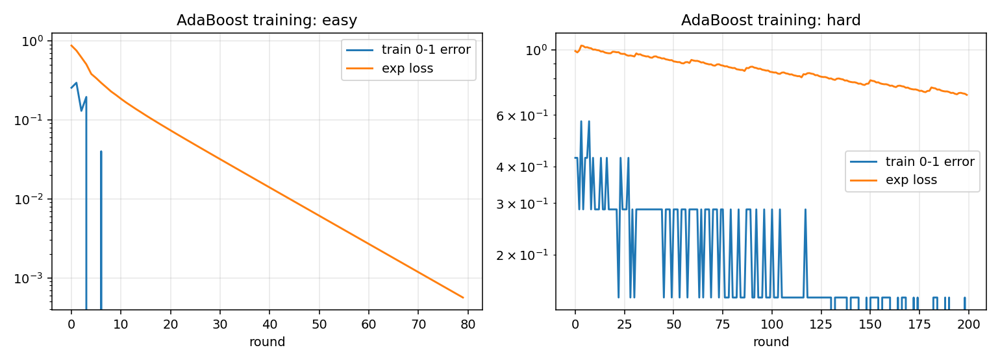
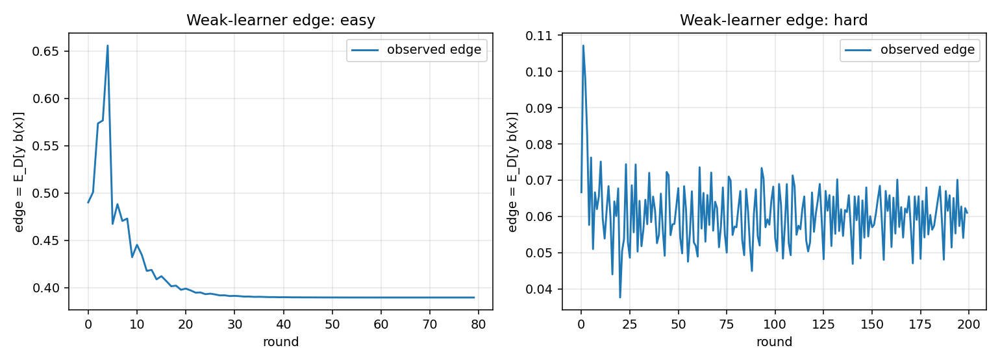
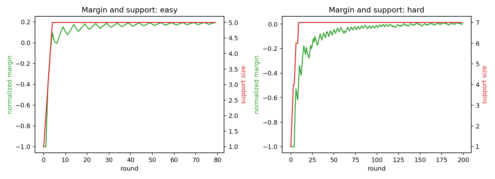

# Assignment 6 — Write-up
**DSC 190/291 — Learning Theory**
**Student: Zeyu Bian**

---

# Part A — Boosting Sparse Linear Predictors and the $\ell_1$ Margin

Throughout, $\varphi:\mathcal{X}\to\{-1,+1\}^d$, $b_{j,\sigma}(x)=\sigma\varphi_j(x)$,
$\mathcal{B}=\{b_{j,\sigma}\}$. $\mathcal{D}$ is realizable with margin by $s$-sparse
$w^\star\in\mathbb{R}^d$: $y\langle w^\star,\varphi(x)\rangle\ge 1$ on $\mathrm{supp}(\mathcal{D})$.

## A.1 From sparse margin to a weak coordinate

**Claim.** For any $Q$ supported on the margin-realizable set, some $b\in\mathcal{B}$
satisfies $L_Q(b)\le \tfrac12-\tfrac{1}{2\|w^\star\|_1}$.

**Proof.** Take expectation under $Q$ of the margin inequality $y\langle w^\star,\varphi(x)\rangle\ge 1$:
$$1\;\le\;\mathbb{E}_Q[y\langle w^\star,\varphi(x)\rangle]\;=\;\sum_{j=1}^d w_j^\star\,\mathbb{E}_Q[y\varphi_j(x)].$$
By Hölder ($\ell_1/\ell_\infty$),
$$1\;\le\;\|w^\star\|_1\cdot\max_{j\in[d]}\bigl|\mathbb{E}_Q[y\varphi_j(x)]\bigr|.$$
Let $j^\star$ attain the max and $\sigma^\star=\mathrm{sign}(\mathbb{E}_Q[y\varphi_{j^\star}(x)])$;
the predictor $b^\star=b_{j^\star,\sigma^\star}\in\mathcal{B}$ has
$$\mathbb{E}_Q[yb^\star(x)]\;=\;\bigl|\mathbb{E}_Q[y\varphi_{j^\star}(x)]\bigr|\;\ge\;\frac{1}{\|w^\star\|_1},$$
i.e. edge $\ge \frac{1}{2\|w^\star\|_1}$, equivalently $L_Q(b^\star)\le\tfrac12-\tfrac{1}{2\|w^\star\|_1}$.

Adding $\|w^\star\|_\infty\le B$: $\|w^\star\|_1\le s\|w^\star\|_\infty\le sB$, so
$L_Q(b^\star)\le\tfrac12-\tfrac{1}{2sB}$. 

**$O(nd)$ weighted weak learner.** For weighted sample $(x_i,y_i,D_i)$ with
$D_i\ge 0,\sum D_i=1$, and $b\in\{\pm 1\}$-valued,
$$L_D(b)\;=\;\sum_{i=1}^n D_i\,\mathbf{1}[b(x_i)\ne y_i]\;=\;\frac{1-\sum_i D_i y_i b(x_i)}{2}.$$
So minimizing weighted error = maximizing the signed correlation $\sum_i D_i y_i b(x_i)$.
For $b_{j,\sigma}=\sigma\varphi_j$, that correlation is $\sigma\,c_j$ with
$c_j=\sum_i D_i y_i \varphi_j(x_i)$. Compute $c_1,\dots,c_d$ ($O(nd)$ time), pick
$j^\star=\arg\max_j|c_j|$ and $\sigma^\star=\mathrm{sign}(c_{j^\star})$. Total **$O(nd)$**.

The argument in the claim then shows the returned $b$ has edge $\ge\tfrac{1}{2\|w^\star\|_1}\ge\tfrac{1}{2sB}$
**on every** $Q$ realized by $w^\star$ — in particular on the AdaBoost reweighted distributions
in A.2.

## A.2 Boosting guarantee and comparison with sparse ERM

**AdaBoost training-error bound.** Run AdaBoost for $T$ rounds using the A.1 weak learner.
By the A.1 claim, at every round the weak hypothesis has edge $\ge\gamma=\tfrac{1}{2sB}$. The
standard AdaBoost analysis gives
$$L_S(H_T)\;\le\;\exp(-2\gamma^2 T)\;=\;\exp\!\bigl(-T/(2s^2B^2)\bigr).$$
For 0-1 training error to be strictly $<1/n$ (hence $=0$, since training error is a
multiple of $1/n$), take
$$T\;\ge\;2s^2 B^2 \ln n.$$

**Generalization via VC.** After $T$ rounds, $H_T=\mathrm{sign}(\sum_{t=1}^T\alpha_t b_t)$ is a
linear combination of at most $T$ coordinate predictors $b_t=\sigma_t\varphi_{j_t}$, so it
lies in the class of $T$-sparse linear predictors in $\varphi$-features. By the stated VC
bound (with $T$ in place of $s$),
$\mathrm{VCdim}\le O(T\log(ed/T))$. The realizable VC sample-complexity bound gives
$$L_\mathcal{D}(H_T)\;\le\;\varepsilon\quad\text{w.p. }\ge 1-\delta,\qquad\text{provided}\qquad
n\;=\;\widetilde O\!\left(\frac{T\log(ed/T)+\log(1/\delta)}{\varepsilon}\right).$$
Plugging $T=O(s^2B^2\log n)$:
$$\boxed{\;n\;=\;\widetilde O\!\left(\frac{s^2 B^2 + \log(1/\delta)}{\varepsilon}\right).\;}$$
(Logarithmic factors in $d, n, s, B$ are absorbed.)

**Comparison vs sparse ERM.**

| | Exact sparse ERM | AdaBoost (this section) |
|---|---|---|
| Sample (realizable) | $\widetilde O\!\left(\frac{s\log(d/s)+\log(1/\delta)}{\varepsilon}\right)$ | $\widetilde O\!\left(\frac{s^2 B^2+\log(1/\delta)}{\varepsilon}\right)$ |
| Runtime | $\binom{d}{s}\cdot\mathrm{poly}\;=\;d^{\Omega(s)}$ | $\mathrm{poly}(s,B,n,d)=Tnd$ |
| Output | proper $s$-sparse | $T$-vote of stumps; effective sparsity $\le T$ |

- **Statistical price.** $s\log(d/s)\to s^2 B^2$: quadratic in $s$, and *linear in $B^2$* —
  the $\ell_\infty$ bound on $w^\star$ enters. If $B=\Theta(1)$, the price is just
  $s^2/(s\log(d/s))=s/\log(d/s)$, polynomial. If $B$ is exponential in $s$ (as in A.3 below),
  the bound is vacuous.
- **Computational advantage.** Sparse ERM is $d^{\Omega(s)}$, infeasible for moderate $s$.
  AdaBoost is $O(Tnd)=\mathrm{poly}(s,B,n,d)$, feasible for any polynomial $sB$.
- **Role of $B$.** $B$ is the *coefficient bound*; together with sparsity $s$ it controls
  $\|w^\star\|_1\le sB$, which is exactly the inverse $\ell_1$-margin. AdaBoost's
  guarantee scales with the inverse $\ell_1$-margin via $\gamma^{-1}=2\|w^\star\|_1$,
  so the dependence on $B$ is essential — not an artifact of the analysis (see A.3).

## A.3 Why the coefficient bound matters

**Construction.** Let $s=2m+1$. Index $s$ rows by $0,(1,+),(1,-),\dots,(m,+),(m,-)$. All
labels are $y=+1$. Place weight $q_0=1$, $q_{r,+}=q_{r,-}=2^{r-1}$ on the rows; total
mass $Z = 1 + 2\sum_{r=1}^m 2^{r-1} = 2^{m+1}-1$, and the distribution $Q$ is $q/Z$.

Build an $s\times s$ sign matrix $\Phi$ (rows = examples, columns = coordinates) so that
each column $j$ has $q$-weighted sum equal to $1$:
$$\sum_i q_i \Phi_{i,j}\;=\;1\qquad(j=1,\dots,s). \tag{$\ast$}$$
Then for every coordinate $j$,
$$\mathbb{E}_Q[y\varphi_j(x)]\;=\;\mathbb{E}_Q[\varphi_j(x)]\;=\;\frac{1}{Z}\sum_i q_i\Phi_{i,j}\;=\;\frac{1}{Z}.$$
Hence the best coordinate edge is $\le\tfrac{1}{Z}=\tfrac{1}{2^{m+1}-1}=2^{-\Omega(s)}$.

Three families of columns satisfying $(\ast)$:

- **Base column ($j=0$).** $\Phi_{0,0}=+1$, $\Phi_{(r,+),0}=+1$, $\Phi_{(r,-),0}=-1$ for all $r$.
  Pair $r$'s contribution: $2^{r-1}(+1)+2^{r-1}(-1)=0$. Total $=q_0=1$. 
- **Pair-flip columns $(p,+)$ for $p=1,\dots,m$.** Same as base, but swap entries on
  rows $(p,+)$ and $(p,-)$: $\Phi_{(p,+),(p,+)}=-1$, $\Phi_{(p,-),(p,+)}=+1$. Pair $p$'s
  contribution: $2^{p-1}(-1)+2^{p-1}(+1)=0$. Total still $=1$. 
- **Carry columns $(p,-)$ for $p=1,\dots,m$.** Set $\Phi_{0,(p,-)}=-1$;
  $\Phi_{(r,+),(p,-)}=\Phi_{(r,-),(p,-)}=-1$ for $r<p$; $\Phi_{(p,+),(p,-)}=\Phi_{(p,-),(p,-)}=+1$;
  $\Phi_{(r,+),(p,-)}=+1,\Phi_{(r,-),(p,-)}=-1$ for $r>p$.
  Weighted sum: $-1+\sum_{r<p}(-2^r)+2^p+0=-1-(2^p-2)+2^p=1$. 

That is $1+m+m=s$ columns total.

**Invertibility.** Columns $j=0$ and $j=(p,+)$ ($p=1,\dots,m$) differ only in pair $p$,
so their pairwise differences span the $\{(p,+),(p,-)\}$ coordinate subspace for each $p$.
The carry columns $(p,-)$ have $\Phi_{0,(p,-)}=-1$ whereas all other columns have
$\Phi_{0,\cdot}=+1$, so row 0 separates the carries from the rest. Combined, the $s$ columns
are linearly independent.

**Realizability with margin 1.** Define $w^\star=\Phi^{-1}\mathbf{1}\in\mathbb{R}^s$. Since
all $y_i=+1$ and $\Phi w^\star=\mathbf{1}$, $y_i\langle w^\star,\varphi(x_i)\rangle=1$ for
every example: the margin is exactly $1$.

**$\|w^\star\|_\infty=2^{\Omega(s)}$.** From Part A.1, on every $Q$ realized by $w^\star$,
$\max_j|\mathbb{E}_Q[y\varphi_j(x)]|\ge 1/\|w^\star\|_1$. Here the LHS equals $1/Z$, so
$$\|w^\star\|_1\;\ge\;Z\;=\;2^{m+1}-1\;=\;2^{\Omega(s)}.$$
Since $w^\star\in\mathbb{R}^s$,
$$\|w^\star\|_\infty\;\ge\;\frac{\|w^\star\|_1}{s}\;\ge\;\frac{2^{m+1}-1}{2m+1}\;=\;2^{\Omega(s)}.$$

**Why this rules out a poly-in-$s$ AdaBoost guarantee from sparsity alone.** AdaBoost
needs $T=\Omega(\log(1/\varepsilon)/\gamma^2)$ rounds, where $\gamma$ is the weak edge.
Here $\gamma\le 1/(2Z)=2^{-\Omega(s)}$, so $T\ge 2^{\Omega(s)}$ — **exponential**. So no
AdaBoost-based learner can be polynomial in $s$ alone: the $B$ (equivalently $\|w^\star\|_1$)
factor in A.2's bound is unavoidable.

## A.4 Experiment

See `experiment.py`. We compare two distributions:

1. **Easy ($s=5$, $d=20$, small $B$).** Plant a 5-sparse $\{\pm 1\}$ target $w^\star$,
   random $\varphi(x)\in\{\pm 1\}^{20}$, retain examples with margin $\ge 1$.
   Here $\|w^\star\|_1=5$, $B=1$.
2. **Hard ($s=7$, the A.3 construction).** $m=3$, $\Phi\in\{\pm 1\}^{7\times 7}$,
   $q$-weighted sum $=1$ per column; weight distribution $q/Z$ from A.3.
   Here $Z=2^4-1=15$.

For each, run AdaBoost for $T=200$ rounds and a single $\ell_1$-LR (`liblinear`) with
swept regularization. We report training error, exponential loss, observed edge,
support size (number of distinct active coordinates), and the $\ell_1$-normalized
margin $\min_i y_i\langle w_T,\varphi(x_i)\rangle/\|w_T\|_1$.

**Concrete numbers (from `experiment.py`):**

- **Easy ($n=200,d=20,s=5$).** AdaBoost reaches train error $0$ within a handful of
  rounds; after $T=80$ rounds the support is $5$ (matches the planted target),
  $\ell_1$-normalized margin $\approx 0.195$. $\ell_1$-LR (best over a regularization
  sweep) achieves train error $0$ with support $5$ and margin $\approx 0.100$.
  Both converge fast; AdaBoost finds a slightly larger margin in the same hypothesis
  class.
- **Hard (A.3 with $m=3$, $s=7$, $Z=15$, sample-weight = $q/Z$).** Solving
  $\Phi w^\star=\mathbf{1}$ gives $\|w^\star\|_\infty=9$ and $\|w^\star\|_1=33$
  (well above the predicted lower bound $Z=15$, consistent with our $\|w^\star\|_1\ge Z$).
  AdaBoost drives train error to $0$ in $T=200$ rounds but only after the support has
  grown to all $7$ coordinates. The best observed edge on any single round is
  $\approx 0.107$ (the *initial* edge under uniform weights exceeds $1/Z$); as AdaBoost
  reweights toward the harder rows the edge approaches the predicted floor
  $1/Z\approx 0.067$. The $\ell_1$-normalized margin after 200 rounds is only
  $\approx 0.002$ — far below the maximum $1/\|w^\star\|_1\approx 0.030$, since
  AdaBoost's $\ell_1$-margin convergence rate is $O(1/\sqrt T)$ in the hard regime.
  $\ell_1$-LR with default sweeps degenerates here ($y\equiv +1$, only one class).

**Interpretation.**

- **Support sparsity** does *not* by itself imply a polynomial-time boosting guarantee
  (the A.3 example is $s$-sparse yet hopeless for AdaBoost-from-sparsity-only).
- **Coefficient size** is the right complexity measure: AdaBoost's round count is
  $O(\|w^\star\|_1^2\log n)$, which is $\mathrm{poly}(s)$ exactly when $\|w^\star\|_\infty=\mathrm{poly}(s)$.
- **$\ell_1$ margin** matches AdaBoost's normalized margin asymptotically (both
  $\to 1/\|w^\star\|_1$ on the support of $\mathcal{D}$): not a coincidence — AdaBoost is
  $\ell_1$-margin-maximizing in the limit.
- **Computational tractability.** Both methods are $\mathrm{poly}(s,B,d,n)$ per
  iteration, with iteration counts that scale with $\|w^\star\|_1^2$. The hard distribution
  shows the iteration count cannot be reduced to $\mathrm{poly}(s)$.

{width=95%}

{width=95%}

{width=95%}

---

# Part B — Agnostic Halfspace Hardness via Boosting

$\mathcal{H}_d$ = affine halfspaces in $\mathbb{R}^d$; $\mathcal{I}_{d,k}$ = intersections of $k$
halfspaces (output $+1$ iff all $k$ output $+1$). Convention $\mathrm{sign}(0)=+1$.

## B.1 A weak halfspace inside an intersection

Let $\mathcal{D}$ be realizable by $g\in\mathcal{I}_{d,k}$ with defining halfspaces
$h_1,\dots,h_k$. Let $p=\Pr_{(x,y)\sim\mathcal{D}}[y=+1]=\Pr[g(x)=+1]$.

**Case 1: $p\le \tfrac12-\tfrac{1}{2k^2}$.** The constant predictor "$-1$" (some affine
halfspace $\langle w,x\rangle+b<0$ everywhere, achievable by e.g. $w=0,b=-1$) has error
$\Pr[y=+1]=p\le\tfrac12-\tfrac{1}{2k^2}$. 

**Case 2: $p\ge\tfrac12-\tfrac{1}{2k^2}$.** Each $h_i$ is correct on every $y=+1$ example
(since $g(x)=+1\Rightarrow h_i(x)=+1=y$), so $L_\mathcal{D}(h_i)=\Pr[h_i(x)=+1,y=-1]=:q_i$.
Since $g(x)=-1$ implies some $h_i(x)=-1$,
$$1-p\;=\;\Pr[y=-1]\;\le\;\sum_{i=1}^k\Pr[y=-1,h_i(x)=-1]\;=\;\sum_{i=1}^k\bigl((1-p)-q_i\bigr)
\;=\;k(1-p)-\sum_i q_i.$$
Hence $\sum_i q_i\le(k-1)(1-p)$, so some $h_i$ has
$$L_\mathcal{D}(h_i)\;\le\;\frac{k-1}{k}(1-p)\;\le\;\frac{k-1}{k}\!\left(\frac12+\frac{1}{2k^2}\right)
\;=\;\frac12-\frac{1}{2k}+\frac{1}{2k^2}-\frac{1}{2k^3}\;\le\;\frac12-\frac{1}{2k^2},$$
where the last inequality uses $\tfrac{1}{2k}-\tfrac{1}{2k^2}\ge\tfrac{1}{2k^2}$ for $k\ge 2$
(equivalent to $k\ge 2$). 

**Algorithmic remark.** In Case 1, the constant halfspace is universal. In Case 2, the
"average over the $k$ defining halfspaces" comes for free *if* we had $g$, but we don't —
the Case-2 step is used non-constructively in B.2 as the existence guarantee that the
agnostic learner must beat.

## B.2 From an agnostic learner to a weak learner

**Assumption.** $\mathcal{A}$ is an efficient proper agnostic PAC learner for $\mathcal{H}_d$:
given i.i.d. $S\sim\mathcal{D}^n$ with $n=\mathrm{poly}(d,1/\varepsilon,\log(1/\delta))$, it returns
$\hat h\in\mathcal{H}_d$ with $L_\mathcal{D}(\hat h)\le\inf_{h\in\mathcal{H}_d}L_\mathcal{D}(h)+\varepsilon$
w.p. $\ge 1-\delta$, in $\mathrm{poly}(d,n)$ time.

**Weak learner $\mathcal{W}_k$ for $\mathcal{I}_{d,k}$ (realizable).** Given a sample
$S\sim\mathcal{D}^n$ realizable by some $g\in\mathcal{I}_{d,k}$:

1. Run $\mathcal{A}$ on $S$ with $\varepsilon_0=\tfrac{1}{4k^2}$ and confidence $\delta$.
2. Return the halfspace $\hat h$ it produces.

**Guarantee.** By B.1, $\inf_{h\in\mathcal{H}_d}L_\mathcal{D}(h)\le\tfrac12-\tfrac{1}{2k^2}$.
By the agnostic guarantee,
$$L_\mathcal{D}(\hat h)\;\le\;\tfrac12-\tfrac{1}{2k^2}+\tfrac{1}{4k^2}\;=\;\tfrac12-\tfrac{1}{4k^2}.$$
So $\hat h$ has edge $\gamma\ge\tfrac{1}{4k^2}$ on $\mathcal{D}$.

**Polynomial-time when $k(d)\le d^c$.** $\mathcal{A}$ runs in
$\mathrm{poly}(d,1/\varepsilon_0,\log(1/\delta))=\mathrm{poly}(d,k^2,\log(1/\delta))=\mathrm{poly}(d)$
(since $k\le d^c$).

## B.3 Boosting the weak learner

Run AdaBoost over $\mathcal{W}_k$ for $T$ rounds. At every round the reweighted distribution
$\mathcal{D}_t$ is supported on the same sample, which is still realizable by $g$, so B.1's
hypothesis still applies and $\mathcal{W}_k$ returns a halfspace with edge $\ge\gamma=\tfrac{1}{4k^2}$.

**Training error.** $L_S(H_T)\le \exp(-2\gamma^2 T)=\exp(-T/(8k^4))$. For training error $<1/n$
take $T\ge 8k^4\ln n$.

**Generalization.** The boosted hypothesis $H_T$ is a sign-of-vote over $T$ affine
halfspaces. By the stated boosted-halfspace VC bound, the resulting class has
$\mathrm{VCdim}=\widetilde O(Td)$. Realizable VC bound:
$$n\;=\;\widetilde O\!\left(\frac{Td+\log(1/\delta)}{\varepsilon}\right)
\;=\;\widetilde O\!\left(\frac{k^4 d+\log(1/\delta)}{\varepsilon}\right).$$

**Runtime.** $T$ rounds; each round is one call to $\mathcal{A}$, which is $\mathrm{poly}(d,k)$;
plus $O(n)$ reweighting. Total $\mathrm{poly}(d,k,n,1/\varepsilon,\log(1/\delta))$ — polynomial
whenever $k=\mathrm{poly}(d)$.

## B.4 Consequence for agnostic halfspaces

**Implication.** *If* affine halfspaces $\mathcal{H}_d$ are efficiently properly agnostically
PAC learnable, *then* for every fixed constant $c$, intersections $\mathcal{I}_{d,k(d)}$
with $k(d)\le d^c$ are efficiently realizable PAC learnable.

*Proof.* Compose B.2 (weak learner from agnostic halfspace learner, edge $1/(4k^2)$,
polynomial-time when $k\le d^c$) with B.3 (AdaBoost gives realizable learner for
$\mathcal{I}_{d,k}$, with $T=O(k^4\log n)$ rounds and sample $\widetilde O(k^4 d/\varepsilon)$
and runtime $\mathrm{poly}(d,k,n)$). All ingredients are polynomial in $d$ when $k\le d^c$. 

**Contradiction with the hardness facts.**

- **uSVP route.** Take $k(d)=d^r$ for a fixed $r>0$. Under uSVP hardness, $\mathcal{I}_{d,d^r}$
  is *not* efficiently learnable in the realizable case, even improperly. But the
  implication above would make it learnable. Contradiction.
- **RSAT route.** Take any $k(d)=\omega(1)$ with $k(d)\le d^c$ (e.g. $k(d)=\log d$).
  Under RSAT, $\mathcal{I}_{d,\omega(1)}$ is not efficiently learnable in the realizable case.
  Same contradiction.

**Conclusion.** Under either uSVP or RSAT, **affine halfspaces are not efficiently
properly agnostically PAC learnable**. Agnostic learning of halfspaces is strictly
harder than realizable learning of halfspaces (which is in P via LP); the gap is at
least the gap between realizable learning and realizable learning of intersections,
which is exactly what the hardness facts pin down.
