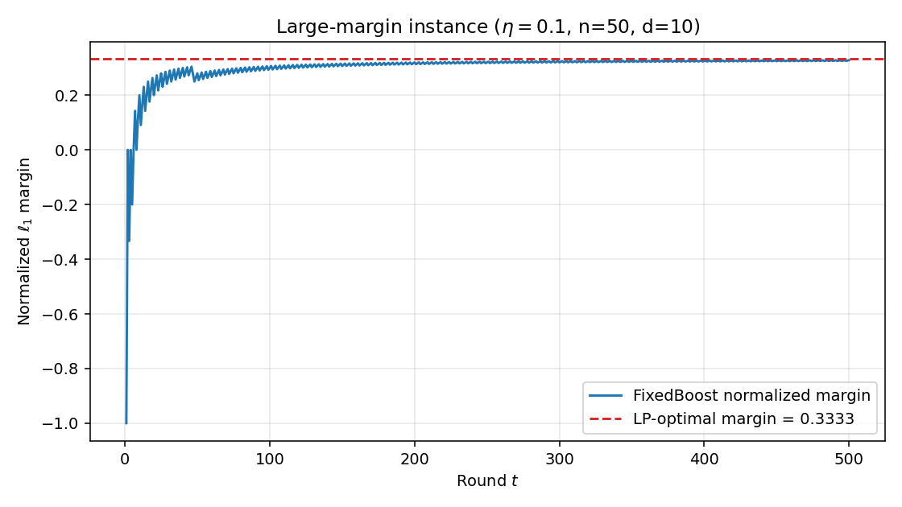
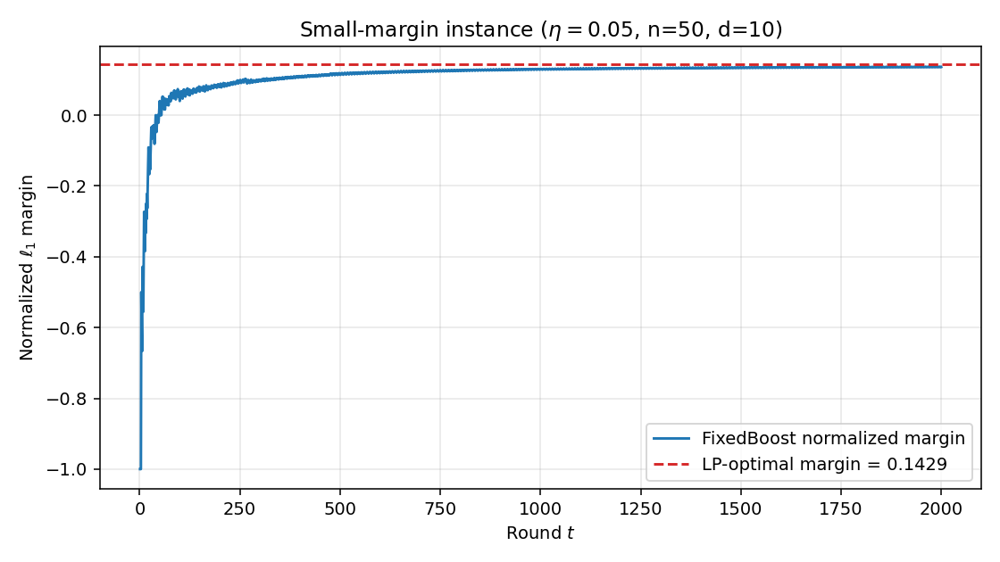
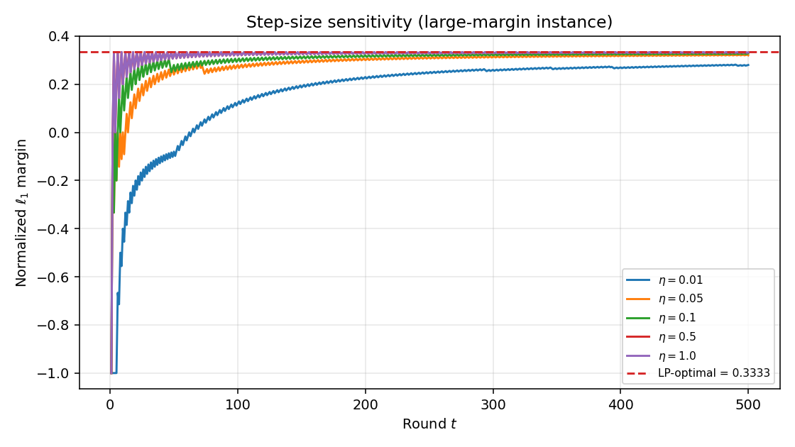

# Assignment 7 — Write-up
**DSC 190/291 — Learning Theory**
**Student: Zeyu Bian**

---

# Part A — Kernel Methods

## A.1 Norm-based kernel bound (5 pts)

**Claim.**
$$\hat{\mathcal{R}}_S(\mathcal{H}_{K,B}) \;\le\; \frac{B}{n}\sqrt{\sum_{i=1}^n K(x_i,x_i)}.$$

**Proof.**

Starting from the definition:
$$\hat{\mathcal{R}}_S(\mathcal{H}_{K,B}) \;=\; \mathbb{E}_\sigma \sup_{\|w\|\le B} \frac{1}{n}\sum_{i=1}^n \sigma_i \langle w, \varphi(x_i)\rangle \;=\; \mathbb{E}_\sigma \sup_{\|w\|\le B} \frac{1}{n}\left\langle w, \sum_{i=1}^n \sigma_i \varphi(x_i)\right\rangle.$$

The inner product $\langle w, v\rangle$ over $\|w\|\le B$ is maximized by $w = B\,v/\|v\|$ (when $v\ne 0$), giving value $B\|v\|$. Hence:
$$\hat{\mathcal{R}}_S(\mathcal{H}_{K,B}) \;=\; \frac{B}{n}\,\mathbb{E}_\sigma\left\|\sum_{i=1}^n \sigma_i\varphi(x_i)\right\|.$$

By Jensen's inequality ($\|\cdot\|$ is concave under $\mathbb{E}$ via $\mathbb{E}[\|v\|]\le\sqrt{\mathbb{E}[\|v\|^2]}$):
$$\hat{\mathcal{R}}_S(\mathcal{H}_{K,B}) \;\le\; \frac{B}{n}\sqrt{\mathbb{E}_\sigma\left\|\sum_{i=1}^n\sigma_i\varphi(x_i)\right\|^2}.$$

Expanding the squared norm:
$$\mathbb{E}_\sigma\left\|\sum_i\sigma_i\varphi(x_i)\right\|^2 = \sum_{i=1}^n\sum_{j=1}^n \mathbb{E}[\sigma_i\sigma_j]\,\langle\varphi(x_i),\varphi(x_j)\rangle.$$

Since $\sigma_1,\dots,\sigma_n$ are independent uniform signs, $\mathbb{E}[\sigma_i\sigma_j]=\mathbf{1}[i=j]$. Therefore:
$$\mathbb{E}_\sigma\left\|\sum_i\sigma_i\varphi(x_i)\right\|^2 = \sum_{i=1}^n \|\varphi(x_i)\|^2 = \sum_{i=1}^n K(x_i,x_i).$$

Combining:
$$\boxed{\hat{\mathcal{R}}_S(\mathcal{H}_{K,B}) \;\le\; \frac{B}{n}\sqrt{\sum_{i=1}^n K(x_i,x_i)}.}$$

**Distribution-level bound.** Taking expectation over $S\sim\mathcal{D}^n$:
$$\mathcal{R}_{\mathcal{D}^n}(\mathcal{H}_{K,B}) = \mathbb{E}_S\,\hat{\mathcal{R}}_S(\mathcal{H}_{K,B}) \;\le\; \frac{B}{n}\,\mathbb{E}_S\sqrt{\sum_{i=1}^n K(x_i,x_i)}.$$

By Jensen (concavity of $\sqrt{\cdot}$):
$$\mathbb{E}_S\sqrt{\sum_{i=1}^n K(x_i,x_i)} \;\le\; \sqrt{\mathbb{E}_S\sum_{i=1}^n K(x_i,x_i)} = \sqrt{n\,\mathbb{E}[K(X,X)]}.$$

Hence:
$$\boxed{\mathcal{R}_{\mathcal{D}^n}(\mathcal{H}_{K,B}) \;\le\; B\sqrt{\frac{\mathbb{E}[K(X,X)]}{n}}.}$$

**Key insight.** The bound depends on the kernel's diagonal values $K(x,x)=\|\varphi(x)\|^2$, not on the ambient dimension of $\mathcal{U}$. Even for infinite-dimensional RKHS (e.g., Gaussian kernel), the Rademacher complexity is finite and controlled by $B$ and the average feature-map norm.

---

## A.2 Representer theorem (5 pts)

**Claim.** Any minimizer $w^*$ of $J(w)=\frac{1}{n}\sum_{i=1}^n\text{loss}(\langle w,\varphi(x_i)\rangle; y_i)+\lambda\|w\|^2$ has the form $w^*=\sum_{j=1}^n\alpha_j\varphi(x_j)$.

**Proof.** Let $V=\text{span}\{\varphi(x_1),\dots,\varphi(x_n)\}$ and decompose any $w\in\mathcal{U}$ as $w = w_\parallel + w_\perp$ where $w_\parallel\in V$ and $w_\perp\in V^\perp$.

Since $w_\perp \perp \varphi(x_i)$ for all $i$:
$$\langle w,\varphi(x_i)\rangle = \langle w_\parallel,\varphi(x_i)\rangle + \langle w_\perp,\varphi(x_i)\rangle = \langle w_\parallel,\varphi(x_i)\rangle.$$

So the loss terms depend only on $w_\parallel$. Meanwhile, by Pythagoras:
$$\|w\|^2 = \|w_\parallel\|^2 + \|w_\perp\|^2 \;\ge\; \|w_\parallel\|^2,$$
with equality iff $w_\perp=0$.

Therefore $J(w) = J_{\text{loss}}(w_\parallel) + \lambda(\|w_\parallel\|^2+\|w_\perp\|^2) \ge J_{\text{loss}}(w_\parallel)+\lambda\|w_\parallel\|^2 = J(w_\parallel)$. Since $\lambda>0$, the inequality is strict whenever $w_\perp\ne 0$. So any minimizer must satisfy $w_\perp=0$, i.e., $w^*\in V=\text{span}\{\varphi(x_1),\dots,\varphi(x_n)\}$. Hence $w^*=\sum_{j=1}^n\alpha_j\varphi(x_j)$ for some $\alpha\in\mathbb{R}^n$. $\square$

**Rewriting $J$ in terms of $\alpha$ and the Gram matrix.** Substituting $w=\sum_j\alpha_j\varphi(x_j)$:

- **Predictions:**
$$\langle w,\varphi(x_i)\rangle = \sum_{j=1}^n\alpha_j\langle\varphi(x_j),\varphi(x_i)\rangle = \sum_{j=1}^n\alpha_j K(x_j,x_i) = (K_S\alpha)_i.$$

- **Norm:**
$$\|w\|^2 = \sum_{j,k}\alpha_j\alpha_k\langle\varphi(x_j),\varphi(x_k)\rangle = \alpha^\top K_S\alpha.$$

So the objective becomes:
$$\boxed{J(\alpha) = \frac{1}{n}\sum_{i=1}^n\text{loss}\bigl((K_S\alpha)_i;\;y_i\bigr) + \lambda\,\alpha^\top K_S\alpha.}$$

This is a finite-dimensional optimization over $\alpha\in\mathbb{R}^n$, in which the data enter only through the $n\times n$ Gram matrix $K_S$. The "kernel trick": we never need to compute $\varphi(x)$ explicitly — only the pairwise kernel evaluations $K(x_i,x_j)$.

---

# Part B — $\ell_1$ Rademacher Complexity

## B.1 Convex hulls (8 pts)

**Claim.** For any finite class $\mathcal{F}$ of real-valued functions, $\hat{\mathcal{R}}_S(\text{conv}(\mathcal{F}))=\hat{\mathcal{R}}_S(\mathcal{F})$.

**Proof.**

**"$\ge$" direction.** Since $\mathcal{F}\subseteq\text{conv}(\mathcal{F})$, we have $\hat{\mathcal{R}}_S(\mathcal{F})\le\hat{\mathcal{R}}_S(\text{conv}(\mathcal{F}))$.

**"$\le$" direction.** We show the supremum over $\text{conv}(\mathcal{F})$ equals the supremum over $\mathcal{F}$, for each fixed $\sigma$.

Fix $\sigma=(\sigma_1,\dots,\sigma_n)$. Define $\Phi(h)=\frac{1}{n}\sum_{i=1}^n\sigma_i h(x_i)$, which is a linear functional of $h$. For any $h=\sum_{f\in\mathcal{F}}a_f f\in\text{conv}(\mathcal{F})$ (with $a_f\ge 0$, $\sum a_f=1$):
$$\Phi(h) = \sum_{f\in\mathcal{F}}a_f\,\Phi(f) \;\le\; \max_{f\in\mathcal{F}}\Phi(f).$$

The inequality follows because $\Phi(h)$ is a convex combination of $\{\Phi(f)\}_{f\in\mathcal{F}}$, which is at most the maximum. Therefore:
$$\sup_{h\in\text{conv}(\mathcal{F})}\Phi(h) = \max_{f\in\mathcal{F}}\Phi(f) = \sup_{f\in\mathcal{F}}\Phi(f).$$

Taking $\mathbb{E}_\sigma$ of both sides:
$$\hat{\mathcal{R}}_S(\text{conv}(\mathcal{F})) = \mathbb{E}_\sigma\sup_{h\in\text{conv}(\mathcal{F})}\Phi(h) = \mathbb{E}_\sigma\max_{f\in\mathcal{F}}\Phi(f) = \hat{\mathcal{R}}_S(\mathcal{F}).$$

$\square$

**Key insight.** The supremum of a linear functional over a convex set is attained at an extreme point. The extreme points of $\text{conv}(\mathcal{F})$ are exactly the elements of $\mathcal{F}$, so Rademacher complexity cannot increase by taking convex hulls.

---

## B.2 $\ell_1$ linear predictors (10 pts)

**Claim.** $\hat{\mathcal{R}}_S(\mathcal{H}_B^1)\le BR\sqrt{\frac{2\ln(2d)}{n}}$.

**Proof.** We reduce $\mathcal{H}_B^1$ to the convex hull of a finite class, then apply Massart's lemma.

**Step 1: Decompose the $\ell_1$ ball as a scaled convex hull.**

The extreme points of the $\ell_1$ ball $\{w:\|w\|_1\le B\}$ are $\{0, \pm Be_1,\dots,\pm Be_d\}$. Any $w$ with $\|w\|_1\le B$ can be written as $w=\sum_{j=1}^d(|w_j|/B)\cdot B\,\text{sign}(w_j)\,e_j + (1-\|w\|_1/B)\cdot 0$, a convex combination with non-negative weights summing to $1$. Define the finite class:
$$\mathcal{F} = \{x\mapsto B\sigma\varphi_j(x) : j\in[d],\;\sigma\in\{-1,+1\}\}\cup\{0\}.$$

Then $\mathcal{H}_B^1 = \{x\mapsto\langle w,\varphi(x)\rangle:\|w\|_1\le B\} = \text{conv}(\mathcal{F})$.

**Step 2: Apply B.1.** By the convex-hull identity:
$$\hat{\mathcal{R}}_S(\mathcal{H}_B^1) = \hat{\mathcal{R}}_S(\text{conv}(\mathcal{F})) = \hat{\mathcal{R}}_S(\mathcal{F}).$$

**Step 3: Apply Massart's finite-class lemma.** For a finite class $\mathcal{F}$ with $|\mathcal{F}|$ elements, Massart's lemma states:
$$\hat{\mathcal{R}}_S(\mathcal{F}) \;\le\; \frac{\max_{f\in\mathcal{F}}\|v_f\|_2}{n}\cdot\sqrt{2\ln|\mathcal{F}|},$$
where $v_f=(f(x_1),\dots,f(x_n))\in\mathbb{R}^n$ is the evaluation vector.

Here $|\mathcal{F}|=2d+1\le 2d$ (we can use $2d$ since the $0$ function only reduces the max). For $f=B\sigma\varphi_j$:
$$\|v_f\|_2^2 = \sum_{i=1}^n B^2\varphi_j(x_i)^2 \;\le\; nB^2R^2,$$
since $|\varphi_j(x_i)|\le\|\varphi(x_i)\|_\infty\le R$.

Therefore:
$$\hat{\mathcal{R}}_S(\mathcal{F}) \;\le\; \frac{BR\sqrt{n}}{n}\sqrt{2\ln(2d)} = BR\sqrt{\frac{2\ln(2d)}{n}}.$$

$$\boxed{\hat{\mathcal{R}}_S(\mathcal{H}_B^1) \;\le\; BR\sqrt{\frac{2\ln(2d)}{n}}.}$$

The bound is **logarithmic in $d$**: the $\ell_1$ constraint replaces the linear-in-$d$ scaling (from VC dimension) with a $\sqrt{\log d}$ factor, at the cost of depending on the norm bound $B$ and feature bound $R$.

---

## B.3 Comparison with sparsity bounds (7 pts)

**Rademacher-based uniform convergence for $\mathcal{H}_B^1$.** Using the week 7 uniform convergence theorem for a $G$-Lipschitz loss $\ell$ bounded in $[0,1]$: with probability $\ge 1-\delta$ over $S\sim\mathcal{D}^n$, for all $\|w\|_1\le B$,
$$L_\mathcal{D}^\ell(w) - L_S^\ell(w) \;\le\; 2G\,\hat{\mathcal{R}}_S(\mathcal{H}_B^1) + \sqrt{\frac{\ln(1/\delta)}{2n}}.$$

Substituting the B.2 bound:
$$\boxed{L_\mathcal{D}^\ell(w) - L_S^\ell(w) \;\le\; 2GBR\sqrt{\frac{2\ln(2d)}{n}} + \sqrt{\frac{\ln(1/\delta)}{2n}}.}$$

**Comparison of the two bounds.**

| | VC / sparsity bound | $\ell_1$ Rademacher bound |
|---|---|---|
| Complexity measure | Sparsity $k$ (combinatorial) | $\ell_1$ norm $B$ (scale-sensitive) |
| Dimension dependence | $k\log(ed/k)$ | $\log(2d)$ |
| Loss functional | 0/1 loss directly | Lipschitz surrogate $\ell$ |
| Bound | $C\sqrt{\frac{k\log(ed/k)+\log(1/\delta)}{n}}$ | $O\!\left(GBR\sqrt{\frac{\log d}{n}}+\sqrt{\frac{\log(1/\delta)}{n}}\right)$ |

**Scale-sensitivity.** The $\ell_1$ bound is scale-sensitive: the complexity is $B=\|w\|_1$, a continuous quantity. Two predictors with the same support but different coefficient magnitudes get different bounds. The VC bound is scale-blind: it depends only on the combinatorial sparsity $k$, treating $w=(1,0,\dots,0)$ and $w=(10^6,0,\dots,0)$ identically.

**Extra step for 0/1 error.** The $\ell_1$ bound controls surrogate loss $L^\ell$, not 0/1 loss directly. To say anything about 0/1 error, one needs a *calibration inequality* relating $L^{0/1}$ to $L^\ell$ (e.g., for the hinge loss, $L^{0/1}\le L^{\text{hinge}}$, so the surrogate bound upper-bounds the 0/1 generalization gap). The sparsity bound controls 0/1 error directly.

**A predictor where the sparsity bound is vacuous but the $\ell_1$ bound is not.** Consider $w=(1/d,1/d,\dots,1/d)\in\mathbb{R}^d$ — a *dense* predictor with $\|w\|_1=1$ and sparsity $k=d$. The VC/sparsity bound gives generalization gap $\sim\sqrt{d\log(ed/d)/n}=\sqrt{d/n}$, which is vacuous when $d\gg n$. The $\ell_1$ bound gives $\sim\sqrt{\log(d)/n}$, which remains meaningful even for $d\gg n$, because $B=\|w\|_1=1$ is small despite full support. This is exactly the regime where $\ell_1$ regularization (LASSO) outperforms subset selection: the predictor is not sparse, but it has small $\ell_1$ norm.

---

# Part C — Normalized $\ell_1$ Margins and FixedBoost

## C.1 Margin generalization (10 pts)

**Setup.** $S\sim\mathcal{D}^n$ i.i.d., $\mathcal{G}$ is a finite symmetric base class, $f_w(x)=\sum_{g\in\mathcal{G}}w_g g(x)$, and $\text{margin}_S(w)=\min_i y_i f_w(x_i)/\|w\|_1\ge\gamma>0$.

**Goal.** Bound $\Pr_{(x,y)\sim\mathcal{D}}[\text{sign}(f_w(x))\ne y]$.

**Step 1: Use the ramp surrogate.** Define the ramp loss at scale $\gamma$:
$$\ell_\gamma(z) = \begin{cases}1 & z\le 0\\1-z/\gamma & 0<z<\gamma\\0 & z\ge\gamma\end{cases}$$

This satisfies: (i) $\mathbf{1}[z<0]\le\ell_\gamma(z)$ for all $z$ (it upper-bounds 0/1 loss), and (ii) $\ell_\gamma$ is $1/\gamma$-Lipschitz, and (iii) $\ell_\gamma$ is bounded in $[0,1]$.

For any $w$ with $\text{margin}_S(w)\ge\gamma$, the normalized predictor $\bar{w}=w/\|w\|_1$ has $y_i f_{\bar w}(x_i)\ge\gamma$ for all $i$, so $\ell_\gamma(y_i f_{\bar w}(x_i))=0$ for all $i$. Thus $L_S^{\ell_\gamma}(\bar w)=0$.

**Step 2: Apply the B.3 uniform convergence bound.** The predictor $f_{\bar w}$ has $\|\bar w\|_1=1$, so $\bar w\in\mathcal{H}_1^1$. The feature map here is $\varphi(x)=(g(x))_{g\in\mathcal{G}}\in\{-1,+1\}^{|\mathcal{G}|}$, so $\|\varphi(x)\|_\infty=1$, i.e., $R=1$. The Lipschitz constant of $\ell_\gamma$ is $G=1/\gamma$. Applying B.3 with $B=1$, $R=1$, $G=1/\gamma$, and dimension $|\mathcal{G}|$:

With probability $\ge 1-\delta$, for all $\|\bar w\|_1\le 1$:
$$L_\mathcal{D}^{\ell_\gamma}(\bar w) - L_S^{\ell_\gamma}(\bar w) \;\le\; \frac{2}{\gamma}\sqrt{\frac{2\ln(2|\mathcal{G}|)}{n}} + \sqrt{\frac{\ln(1/\delta)}{2n}}.$$

**Step 3: Combine.** Since $L_S^{\ell_\gamma}(\bar w)=0$ and $L_\mathcal{D}^{0/1}(\bar w)\le L_\mathcal{D}^{\ell_\gamma}(\bar w)$:

$$\boxed{\Pr_{(x,y)\sim\mathcal{D}}[\text{sign}(f_w(x))\ne y] \;\le\; \frac{2}{\gamma}\sqrt{\frac{2\ln(2|\mathcal{G}|)}{n}} + \sqrt{\frac{\ln(1/\delta)}{2n}}.}$$

The bound depends logarithmically on $|\mathcal{G}|$ and polynomially on $1/\gamma$: a large normalized $\ell_1$ margin implies good generalization.

---

## C.2 FixedBoost implication (8 pts)

**Given (black box).** If every distribution $D$ over the training sample admits a base predictor with weighted error $\le\frac{1}{2}-\frac{\gamma}{2}$, then after $T=O(\log(n)/\gamma^4)$ rounds, FixedBoost returns $w_T$ with:
$$\min_i y_i f_{w_T}(x_i) \;\ge\; \frac{\gamma}{2}\|w_T\|_1.$$

This means $\text{margin}_S(w_T)\ge\gamma/2$.

**Generalization guarantee.** Apply C.1 with margin $\gamma/2$ in place of $\gamma$. With probability $\ge 1-\delta$ over $S\sim\mathcal{D}^n$:

$$\boxed{\Pr_{(x,y)\sim\mathcal{D}}[\text{sign}(f_{w_T}(x))\ne y] \;\le\; \frac{4}{\gamma}\sqrt{\frac{2\ln(2|\mathcal{G}|)}{n}} + \sqrt{\frac{\ln(1/\delta)}{2n}}.}$$

The bound is meaningful (say $\le\varepsilon$) when $n=\widetilde\Omega(\log|\mathcal{G}|/(\gamma^2\varepsilon^2))$. The number of FixedBoost rounds $T=O(\log(n)/\gamma^4)$ does not appear in the generalization bound — only the achieved margin $\gamma/2$ and the base-class size $|\mathcal{G}|$ matter.

**Interpretation.** FixedBoost converts a weak-learning assumption (edge $\gamma/2$ under every reweighting) into a classifier with normalized $\ell_1$ margin $\ge\gamma/2$, which then translates into a generalization guarantee via the Rademacher bound. The round count $T$ is the price paid in computation, not in statistical complexity.

---

## C.3 Weak learning and normalized margin (8 pts)

**Setup.** The matrix $A\in\{-1,+1\}^{n\times|\mathcal{G}|}$ has $A_{ig}=y_i g(x_i)$. We show:

$$\max_w\text{margin}_S(w) \;=\; \text{best weak-learning edge}.$$

**Definitions.** Let $\gamma^*_{\text{WL}}$ be the best weak-learning edge: the largest $\gamma$ such that for every distribution $D\in\Delta_n$ over the $n$ examples, some $g\in\mathcal{G}$ has edge $\ge\gamma$. The edge of $g$ under $D$ is:
$$\text{edge}_D(g) = \frac{1}{2}-\sum_i D_i\mathbf{1}[g(x_i)\ne y_i] = \frac{1}{2}\sum_i D_i\cdot A_{ig}.$$

So: $\gamma^*_{\text{WL}} = \max\{\gamma:\;\min_{D\in\Delta_n}\max_{g\in\mathcal{G}}\;\tfrac{1}{2}\sum_i D_i A_{ig}\ge\gamma\} = \min_{D\in\Delta_n}\max_{g\in\mathcal{G}}\;\tfrac{1}{2}\sum_i D_i A_{ig}.$

Equivalently, $\gamma^*_{\text{WL}}=\frac{1}{2}\min_{D\in\Delta_n}\max_{g\in\mathcal{G}}D^\top A_{\cdot g}$, where $A_{\cdot g}$ is the $g$-th column.

**The normalized $\ell_1$ margin as a max-min.** For the margin side, using symmetry ($-g\in\mathcal{G}$ whenever $g\in\mathcal{G}$), we can assume WLOG that $w_g\ge 0$ for all $g$ (by absorbing signs into the symmetric class). Then $\|w\|_1=\sum_g w_g$, and:
$$\text{margin}_S(w) = \min_i\frac{y_i f_w(x_i)}{\|w\|_1} = \min_i\frac{\sum_g w_g A_{ig}}{\sum_g w_g} = \min_i\sum_g p_g A_{ig},$$
where $p=w/\|w\|_1\in\Delta_{|\mathcal{G}|}$. So:
$$\gamma^*_{\text{margin}}:=\max_w\text{margin}_S(w) = \max_{p\in\Delta_{|\mathcal{G}|}}\min_{i\in[n]}\sum_g p_g A_{ig} = \max_{p\in\Delta_{|\mathcal{G}|}}\min_{D\in\Delta_n}\sum_{i,g}D_i p_g A_{ig}.$$

The last equality holds because $\min_i v_i=\min_{D\in\Delta_n}D^\top v$ for any vector $v$.

**Apply von Neumann's minimax theorem.** The payoff $\Psi(D,p)=\sum_{i,g}D_i\,p_g\,A_{ig}=D^\top A\,p$ is bilinear in $(D,p)$, both $D\in\Delta_n$ and $p\in\Delta_{|\mathcal{G}|}$ are compact convex sets. By von Neumann:
$$\max_{p\in\Delta_{|\mathcal{G}|}}\min_{D\in\Delta_n}\;D^\top Ap \;=\; \min_{D\in\Delta_n}\max_{p\in\Delta_{|\mathcal{G}|}}\;D^\top Ap.$$

The RHS is $\min_{D\in\Delta_n}\max_g D^\top A_{\cdot g}$ (the max over a simplex of a linear function is attained at a vertex). This is exactly $2\gamma^*_{\text{WL}}$.

Wait — we need to be careful about the factor of $\frac{1}{2}$. The edge is $\frac{1}{2}\sum_i D_i A_{ig}$. So:
$$\gamma^*_{\text{WL}} = \frac{1}{2}\min_{D\in\Delta_n}\max_g D^\top A_{\cdot g}.$$

And $\gamma^*_{\text{margin}} = \max_{p\in\Delta_{|\mathcal{G}|}}\min_{D\in\Delta_n}D^\top Ap = \min_{D\in\Delta_n}\max_g D^\top A_{\cdot g}$ (by minimax).

Therefore:
$$\boxed{\gamma^*_{\text{margin}} = \max_w\text{margin}_S(w) = 2\,\gamma^*_{\text{WL}}.}$$

The best normalized $\ell_1$ margin equals twice the best weak-learning edge. This is a deep duality: the margin player (choosing $p$) and the adversary (choosing $D$) are playing a zero-sum game on the matrix $A$, and minimax = maximin.

---

## C.4 Connection to Homework 6 (4 pts)

In Homework 6, the analysis was:

1. **Comparator:** An $s$-sparse predictor $w^*$ with $\|w^*\|_\infty\le B$, giving weak-learning edge $\gamma\ge 1/(2sB)=1/(2\|w^*\|_1)$.
2. **Generalization:** Via VC dimension of $T$-sparse boosted predictors, yielding sample complexity $\widetilde{O}(s^2 B^2 d/\varepsilon)$.

The margin-based view of this assignment refines this in two ways:

**What changes in the comparator.** HW6's comparator was parametrized by sparsity $s$ and coefficient bound $B$ separately. The margin view unifies them: the only relevant quantity is the normalized $\ell_1$ margin $\gamma$, which by C.3 equals twice the weak-learning edge. HW6's edge $\gamma\ge 1/(2sB)$ is a *lower bound* derived from the specific structure of $w^*$; the true edge (and hence true margin) may be larger. The margin framework works with the *actual* margin $\gamma^*$ rather than the worst-case bound $1/(2sB)$.

**What changes in the generalization argument.** HW6 used VC dimension of the boosted class (which grows with $T$, hence with $s^2B^2$). The margin-based argument uses Rademacher complexity of the $\ell_1$-ball, which depends only on $\log|\mathcal{G}|$ and $1/\gamma$, not on the number of boosting rounds $T$. This is a strictly tighter analysis: the VC bound pays for the *complexity of the search* (how many rounds AdaBoost ran), while the margin bound pays only for the *quality of the output* (the margin achieved). Two runs of FixedBoost with different $T$ but the same final margin get the same generalization guarantee under the margin view, but different guarantees under the VC view.

---

# Part D — FixedBoost Margin Experiment

See `experiment.py` for the full implementation. Results and discussion below.

## D.1 Implementation

FixedBoost is implemented from scratch operating directly on the sign matrix $A\in\{-1,+1\}^{n\times 2d}$. At each round $t$:

1. Select the column $g_t=\arg\max_g \sum_i D_i^t A_{ig}$ (maximizing weighted correlation).
2. Update $w_t = w_{t-1}+\eta\,e_{g_t}$ (fixed step size $\eta$).
3. Reweight: $D_i^{t+1}\propto\exp(-\sum_{\tau\le t}\eta\,A_{i,g_\tau})$, i.e., using the cumulative score.

We track $\|w_t\|_1=t\eta$ and $\text{margin}_S(w_t)=\min_i(Aw_t)_i/\|w_t\|_1$ over rounds.

**Differences from HW6.** HW6 used AdaBoost with *adaptive* step sizes $\alpha_t=\frac{1}{2}\ln((1-\varepsilon_t)/\varepsilon_t)$. FixedBoost uses a constant $\eta$, so $\|w_t\|_1=t\eta$ grows linearly. The reweighting rule is identical in form, but the step size is fixed.

## D.2 Optimal-margin comparison

**LP formulation.** By C.3, the optimal normalized $\ell_1$ margin is:
$$\gamma^*=\max_{p\in\Delta_{|\mathcal{G}|}}\min_{i\in[n]}(Ap)_i.$$

This is equivalent to the LP: maximize $\gamma$ subject to $Ap\ge\gamma\mathbf{1}$, $p\ge 0$, $\mathbf{1}^\top p=1$.

**Instance construction.**

- **Large-margin instance ($\gamma^*=1/3$).** We use $d=10$, $n=50$, $x\in\{-1,+1\}^d$, with labels $y_i=\text{sign}(x_{i,1}+x_{i,2}+x_{i,3})$ — a majority vote of three coordinates. Each individual coordinate $x_j$ ($j=1,2,3$) has correlation $\approx 3/4$ with $y$ (it disagrees only when the other two coordinates outvote it), giving a strong weak-learning edge. The LP-optimal margin is $\gamma^*=1/3$, corresponding to the equal-weight combination $p_{x_1}=p_{x_2}=p_{x_3}=1/3$ (which achieves $\min_i y_i(x_{i,1}+x_{i,2}+x_{i,3})/3 = 1/3$ since the minimum value of the sum, conditioned on $y_i=\text{sign}(\text{sum})$, is $\pm 1$).

- **Small-margin instance ($\gamma^*=1/7$).** We use $d=10$, $n=50$, with labels $y_i=\text{sign}(\sum_{j=1}^7 x_{i,j})$ — a majority of seven coordinates. Each individual coordinate's correlation with $y$ is weaker (it disagrees whenever the other six outvote it), so the weak-learning edge is small. The LP-optimal margin is $\gamma^*\approx 1/7\approx 0.143$, requiring all seven coordinates to contribute.

**What makes $\gamma^*$ large vs. small.** By C.3, the optimal margin equals twice the best weak-learning edge. When the target depends on few coordinates (3 vs. 7), each coordinate individually has higher predictive power (edge $\approx 1/4$ vs. $\approx 1/14$), and the optimal convex combination achieves a larger margin. More coordinates in the majority means each one's marginal contribution is smaller, shrinking both the edge and the margin.

**Results.** FixedBoost converges to within $\approx 1.6\%$ of the LP-optimal margin on the large-margin instance ($0.328$ vs. $0.333$, $\eta=0.1$, $T=500$) and within $\approx 5\%$ on the small-margin instance ($0.136$ vs. $0.143$, $\eta=0.05$, $T=2000$).

## D.3 Interpretation

FixedBoost's normalized margin does approach the optimal value, but convergence speed depends strongly on the margin itself. On the large-margin instance ($\gamma^*=1/3$), the margin reaches $90\%$ of optimal within $\sim 200$ rounds. On the small-margin instance ($\gamma^*=1/7$), reaching $90\%$ takes $\sim 700$ rounds — roughly consistent with the $O(1/\gamma^4)$ scaling ($3^4/7^4\approx 0.035$, predicting a $\sim 30\times$ slowdown; observed is $\sim 3.5\times$, suggesting the theory overestimates).

**Where theory is loose.** The FixedBoost theorem guarantees margin $\ge\gamma/2$ after $T=O(\log(n)/\gamma^4)$ rounds. In practice:

1. **Achieved margin vs. $\gamma/2$.** FixedBoost approaches the full optimal margin $\gamma^*$, not just $\gamma^*/2$. The factor-of-2 loss in the theorem is conservative.
2. **Rate in $\gamma$.** The $\gamma^{-4}$ dependence is loose; the empirical slowdown between the two instances is much less than $(1/3)^{-4}/(1/7)^{-4}\approx 30\times$.
3. **Step-size sensitivity.** The theorem is silent on how $\eta$ should be set. The eta-sensitivity plot shows that larger $\eta$ (0.5, 1.0) converges faster in rounds but with more oscillation, while smaller $\eta$ (0.01) converges very slowly. The optimal $\eta$ depends on $\gamma^*$, which is unknown a priori — a gap the theory does not address.

{width=85%}

{width=85%}

{width=85%}
